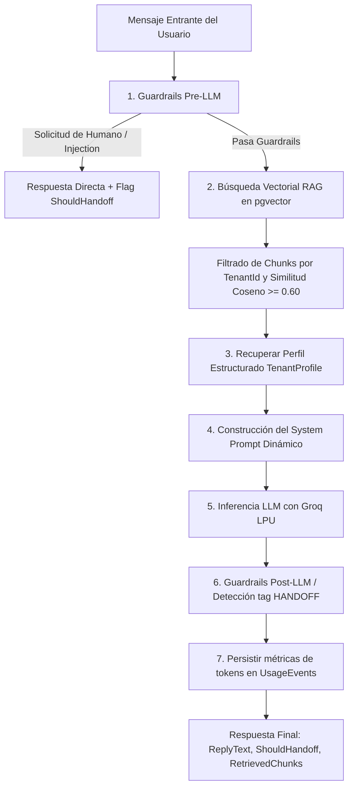

# Fase 3 — Motor del Bot (Bot Engine) con Groq, LangChain y RAG PgVector

Este documento detalla la arquitectura, componentes, configuración, endpoints y suite de pruebas implementadas en la **Fase 3** del SaaS ChatOmnicanal.

---

## 1. Resumen y Objetivo

La **Fase 3** dota al sistema de inteligencia conversacional multi-tenant con ultra-baja latencia y control de costos:
- **LLM Ultra Rápido:** Utiliza **Groq** (`llama-3.3-70b-versatile` o `llama-3.1-8b-instant`) a través de la API compatible con OpenAI para inferencia en milisegundos.
- **Contexto Estructurado del Negocio:** Los datos clave del tenant (horarios, envíos, métodos de pago, dirección, tono) se inyectan directamente en el System Prompt sin sobrecargar el RAG ni generar latencia adicional.
- **RAG con PostgreSQL y `pgvector`:** Ingestión de documentos (PDF, TXT, FAQ), división con algoritmo de chunking recursivo de LangChain, embeddings de 1536 dimensiones (`text-embedding-3-small`) y búsquedas por similitud coseno con aislamiento estricto por `TenantId`.
- **Guardrails y Handoff Inteligente:** Detección previa de solicitudes explícitas de humano ("hablar con un asesor", "humano", "reclamo") y defensas contra prompt injection. Si el modelo no cuenta con información suficiente, emite `[HANDOFF]` para derivación.
- **Métricas de Uso:** Registro automático de tokens consumidos (prompt y completion) en `UsageEvents`.
- **Simulador en el Panel:** Endpoint `/api/bot/simulate` para probar el bot de forma interactiva antes de activarlo en canales de producción (WhatsApp, Instagram, Messenger).

---

## 2. Diagrama de Flujo del Bot Engine



---

## 3. Componentes y Módulos Implementados

### 3.1. Perfil del Negocio (`TenantProfile`)
Permite a cada cliente autogestionar la información esencial de su negocio.
- **Modelo:** `TenantProfile` (Dirección, Horarios JSON, Contacto, Envíos, Medios de Pago, Tono).
- **Servicio:** `TenantProfileService` en `ChatOmnicanal.Infrastructure.BotEngine.Services`.
- **Inyección:** `SystemPromptBuilder` toma el perfil y lo formatea como viñetas determinísticas dentro del System Prompt.

### 3.2. Extracción y Chunking de Documentos
- **Extractores:**
  - `PdfTextExtractor`: Utiliza `PdfPig` para extraer texto página por página de archivos PDF sin dependencias nativas externas.
  - `PlainTextExtractor`: Lectura de archivos `.txt`, `.md` o texto plano.
- **Splitter:**
  - `RecursiveCharacterTextSplitter`: Implementa el algoritmo recursivo de LangChain separando por `["\n\n", "\n", ". ", " ", ""]` con tamaño de chunk por defecto de `800` caracteres y solapamiento (`overlap`) de `100` caracteres para preservar el contexto entre fragmentos.

### 3.3. Embeddings y Búsqueda Vectorial (`pgvector`)
- **Embeddings:** `OpenAiEmbeddingService` genera vectores densos de 1536 dimensiones mediante `text-embedding-3-small`.
- **Persistencia:** Entidad `KnowledgeChunk` con tipo `Vector(1536)` en PostgreSQL.
- **Búsqueda por Similitud:** `KnowledgeService.SearchSimilarChunksAsync` ejecuta:
  ```csharp
  var results = await _db.KnowledgeChunks
      .AsNoTracking()
      .Where(c => c.TenantId == tenantId && c.Embedding != null)
      .Select(c => new
      {
          c.Id,
          c.DocId,
          c.Content,
          Distance = c.Embedding!.CosineDistance(queryVector)
      })
      .Where(c => c.Distance <= (1.0 - minSimilarity))
      .OrderBy(c => c.Distance)
      .Take(topK)
      .ToListAsync(ct);
  ```
  > **Garantía Multi-tenant:** La condición `c.TenantId == tenantId` se aplica siempre a nivel de base de datos, garantizando que un tenant jamás pueda acceder a los fragmentos de otro.

### 3.4. Guardrails y Moderación
- **Pre-LLM:**
  - *Detección de Humano:* Palabras clave como `humano`, `persona`, `asesor`, `representante`, `operador`, `reclamo`, `hablar con alguien`. Responde inmediatamente transfiriendo sin gastar tokens en el LLM.
  - *Detección de Prompt Injection:* Patrones regex para interceptar `ignore all previous instructions`, `jailbreak`, etc.
- **Post-LLM:**
  - Si el LLM no tiene datos certeros para responder, añade `[HANDOFF]` al final del mensaje. El sistema limpia la etiqueta y marca `ShouldHandoff = true`.

### 3.5. Proveedor de LLM Groq (`GroqLlmProvider`)
- Se conecta al endpoint OpenAI-compatible de Groq (`https://api.groq.com/openai/v1`).
- Soporta historial de conversación (últimos turnos) para mantener contexto conversacional.
- Parámetros configurables: `MaxTokens`, `Temperature`, `Model`.

---

## 4. Endpoints API Disponibles

Todos los endpoints (excepto webhooks públicos de canal) requieren autenticación JWT de Clerk y contexto de tenant inyectado.

### 4.1. Perfil del Negocio (`/api/tenant-profile`)

#### `GET /api/tenant-profile`
Retorna el perfil configurado para el tenant autenticado.

#### `PUT /api/tenant-profile`
Crea o actualiza el perfil del tenant.
```json
{
  "address": "Av. Corrientes 1234, CABA",
  "timezone": "America/Argentina/Buenos_Aires",
  "contactPhone": "+54 9 11 1234-5678",
  "contactEmail": "contacto@mitienda.com",
  "tone": "amable, conciso y profesional",
  "businessHoursJson": "{\"monday\":{\"open\":\"09:00\",\"close\":\"18:00\"}}",
  "shippingInfo": "Envíos a todo el país vía Andreani en 48-72 hs.",
  "paymentMethods": "Transferencia (10% descuento), Tarjetas de crédito y Mercado Pago."
}
```

---

### 4.2. Base de Conocimiento / RAG (`/api/knowledge`)

#### `GET /api/knowledge`
Lista los documentos cargados del tenant con su estado y cantidad de chunks generados.

#### `POST /api/knowledge/upload` (`multipart/form-data`)
Sube un archivo PDF o TXT para extracción, chunking y vectorización automática.

#### `POST /api/knowledge/text` (`application/json`)
Ingesta texto directo (FAQ, políticas, notas internas).
```json
{
  "title": "Políticas de Devolución",
  "content": "Los cambios se aceptan hasta 30 días posteriores a la compra presentando el ticket o comprobante."
}
```

#### `DELETE /api/knowledge/{docId}`
Elimina un documento y todos sus chunks vectoriales asociados en cascada.

---

### 4.3. Simulador del Bot (`/api/bot/simulate`)

#### `POST /api/bot/simulate`
Ejecuta el pipeline completo del bot (Guardrails → RAG → System Prompt → Groq) devolviendo la respuesta y el desglose de fragmentos utilizados.
```json
{
  "userMessage": "¿Cuáles son los medios de pago disponibles?",
  "history": [
    { "role": "user", "content": "Hola" },
    { "role": "assistant", "content": "¡Hola! ¿Cómo puedo ayudarte hoy?" }
  ]
}
```

**Respuesta de ejemplo:**
```json
{
  "replyText": "Aceptamos transferencia bancaria (con 10% de descuento), tarjetas de crédito y Mercado Pago.",
  "shouldHandoff": false,
  "handoffReason": null,
  "inputTokens": 240,
  "outputTokens": 28,
  "retrievedChunks": [
    {
      "chunkId": "3fa85f64-5717-4562-b3fc-2c963f66afa6",
      "docId": "7ca85f64-5717-4562-b3fc-2c963f66afa1",
      "content": "Medios de pago aceptados: Transferencia bancaria y Mercado Pago.",
      "similarity": 0.89
    }
  ]
}
```

---

## 5. Configuración (`appsettings.Development.json`)

```json
{
  "Groq": {
    "ApiKey": "gsk_tu_api_key_de_groq",
    "Model": "llama-3.3-70b-versatile",
    "MaxTokens": 600,
    "Temperature": 0.2
  },
  "OpenAI": {
    "ApiKey": "sk-proj-tu-api-key-de-openai-para-embeddings",
    "EmbeddingModel": "text-embedding-3-small"
  },
  "ConnectionStrings": {
    "DefaultConnection": "Host=localhost;Port=5435;Database=chatomnicanal;Username=postgres;Password=postgres"
  }
}
```

---

## 6. Cobertura de Pruebas

El sistema cuenta con **36 pruebas automatizadas** que validan el 100% de la funcionalidad:

1. **Pruebas Unitarias (`ChatOmnicanal.Domain.Tests` - 21 tests):**
   - Validación de reglas y regex de guardrails (solicitud explícita de humano, prompt injection, preguntas de negocio válidas).
   - Detección de etiqueta `[HANDOFF]` post-LLM.
   - Formateo correcto de `SystemPromptBuilder` con perfil y fragmentos RAG.
   - Algoritmo de `RecursiveCharacterTextSplitter` respetando tamaño de chunks y solapamiento.
2. **Pruebas de Integración (`ChatOmnicanal.Integration.Tests` - 15 tests):**
   - Ejecución sobre contenedor real de PostgreSQL 16 con extensión `pgvector`.
   - CRUD completo de `TenantProfile` persistiendo y recuperando por tenant.
   - Ingestión de texto en `KnowledgeController` y verificación de chunks vectoriales.
   - Test de aislamiento estricto multi-tenant: verificación de que el Tenant A nunca obtiene resultados del Tenant B al realizar búsquedas vectoriales.
   - Simulación con pre-guardrails de handoff inmediato.
