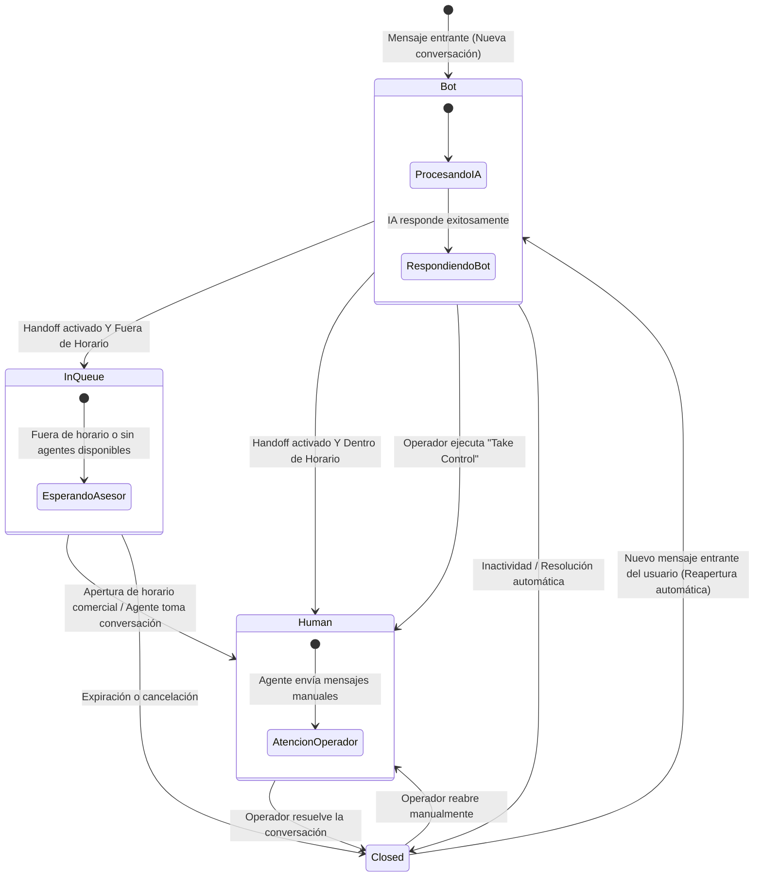

# Fase 4 — Enrutador de Estado Conversacional y Handoff (Bot → Humano → Bot)

Este documento detalla la arquitectura, máquinas de estado, políticas de horarios y ventanas de mensajería, endpoints del inbox de agentes y suite de pruebas implementadas en la **Fase 4** del SaaS ChatOmnicanal.

---

## 1. Resumen y Objetivo

La **Fase 4** orquesta el ciclo de vida completo de cada conversación omnicanal (WhatsApp, Instagram, Facebook Messenger), gestionando la alternancia entre la atención autónoma del bot de IA y la intervención de operadores humanos:

- **Máquina de Estados Robusta:** Transiciones determinísticas entre `Bot`, `InQueue`, `Human` y `Closed`.
- **Detección y Handoff Automático:** Cuando un cliente solicita un asesor o el motor de IA no puede responder, la conversación transiciona a cola de espera o atención humana sin fricción.
- **Gestión de Horarios de Atención (`BusinessHoursService`):**
  - Soporte de zonas horarias IANA (ej. `America/Argentina/Buenos_Aires`).
  - Detección de fuera de horario con cálculo del próximo momento de apertura y mensaje informativo automático.
- **Ventanas de Mensajería de Meta (`MessagingWindowService`):**
  - Verificación de la ventana de 24 horas a partir del último mensaje del usuario (`LastUserMessageAt`).
  - Soporte para la ventana extendida de 7 días con tag `HUMAN_AGENT` en Instagram Direct y Facebook Messenger.
  - Prevención de envíos fallidos fuera de ventana con advertencias claras a los agentes.
- **Bandeja de Entrada para Asesores (`ConversationsController`):** Endpoints REST completos para listar conversaciones por estado/canal, ver historial cronológico, tomar control, enviar respuestas manuales, resolver y reabrir conversaciones.

---

## 2. Diagrama de Estados de la Conversación



---

## 3. Componentes y Módulos Implementados

### 3.1. Servicio de Horarios de Atención (`BusinessHoursService`)
Ubicado en `ChatOmnicanal.Application.Conversations`:
- Parsea el horario comercial semanal estructurado en formato JSON almacenado en `TenantProfile`.
- Evalúa si el momento actual (`DateTime.UtcNow`) cae dentro de una franja operativa según la zona horaria del tenant.
- Calcula de forma precisa el próximo día y hora de apertura (`NextOpeningDescription`), generando mensajes dinámicos:
  > *"Actualmente estamos fuera de nuestro horario de atención. Nuestro equipo te responderá el martes a las 09:00 hs."*

### 3.2. Servicio de Ventana de Mensajería (`MessagingWindowService`)
Ubicado en `ChatOmnicanal.Application.Conversations`:
- **Ventana de 24 Horas Estándar:** Calcula el tiempo restante antes de que expire la posibilidad de enviar mensajes de texto libre en WhatsApp y canales de Meta.
- **Tag `HUMAN_AGENT`:** Para canales de Instagram y Messenger vinculados a páginas de Facebook verificadas, permite enviar respuestas de agentes humanos hasta 7 días posteriores al mensaje del usuario.
- **Validación previa al envío:** Si la ventana de 24h expiró en WhatsApp, rechaza el envío manual informando que se requiere una plantilla de mensaje (Template Message).

### 3.3. Enrutador de Estado (`ConversationStateRouter`)
Ubicado en `ChatOmnicanal.Application.Conversations`:
- Coordina el procesamiento de cada mensaje entrante:
  1. Si la conversación está en estado **`Bot`**: Invoca al `IBotEngineService`. Si se resuelve autónomamente, persiste el mensaje y lo despacha al canal. Si activa handoff (`ShouldHandoff = true`), evalúa horarios comerciales para derivar a `Human` o `InQueue`.
  2. Si la conversación está en estado **`Human`** o **`InQueue`**: Persiste el mensaje del usuario, actualiza `LastUserMessageAt` y notifica a los operadores sin emitir respuesta del bot.
  3. Si la conversación está en estado **`Closed`**: La reabre automáticamente en estado `Bot` para un nuevo ciclo de atención.

### 3.4. Servicio y Controlador de Conversaciones (`ConversationsController`)
Ubicado en `ChatOmnicanal.API.Controllers`:
- Permite la gestión integral de la bandeja de entrada para operadores y supervisores.
- Incluye paginación, filtros por estado (`Bot`, `Human`, `InQueue`, `Closed`), canal (`WhatsApp`, `Instagram`, `Messenger`) y búsqueda por nombre o teléfono del cliente.

---

## 4. Endpoints API Disponibles

Todos los endpoints requieren autenticación JWT de Clerk y contexto de tenant.

### 4.1. Listar Conversaciones

#### `GET /api/conversations`
Retorna la lista de conversaciones paginadas con metadata de canal, contacto, estado y última interacción.

**Parámetros de consulta (Query Params):**
- `status`: `Bot`, `InQueue`, `Human`, `Closed` *(opcional)*
- `channelType`: `WhatsApp`, `Instagram`, `Messenger` *(opcional)*
- `page`: Número de página (default: 1)
- `pageSize`: Cantidad de elementos (default: 20, max: 100)

**Ejemplo de Respuesta:**
```json
{
  "totalCount": 45,
  "page": 1,
  "pageSize": 20,
  "items": [
    {
      "id": "7b508f64-5717-4562-b3fc-2c963f66afa1",
      "channelType": "WhatsApp",
      "contactName": "María Fernández",
      "contactExternalId": "+5491144445555",
      "status": "Human",
      "assignedToUserId": "user_2test123",
      "lastMessageAt": "2026-10-06T19:30:00Z",
      "lastMessagePreview": "¿Tienen stock del modelo en talle M?",
      "unreadCount": 1,
      "createdAt": "2026-10-06T18:00:00Z"
    }
  ]
}
```

---

### 4.2. Detalle de Conversación y Mensajes

#### `GET /api/conversations/{id}`
Retorna los datos completos de la conversación, el historial cronológico de mensajes y el estado de la ventana de 24 horas.

**Ejemplo de Respuesta:**
```json
{
  "id": "7b508f64-5717-4562-b3fc-2c963f66afa1",
  "channelId": "1b508f64-5717-4562-b3fc-2c963f66afa0",
  "channelType": "WhatsApp",
  "contact": {
    "id": "2b508f64-5717-4562-b3fc-2c963f66afa2",
    "name": "María Fernández",
    "externalId": "+5491144445555"
  },
  "status": "Human",
  "assignedToUserId": "user_2test123",
  "windowStatus": {
    "is24HourWindowOpen": true,
    "expiresAt": "2026-10-07T19:30:00Z",
    "hoursRemaining": 23.5,
    "canSendFreeformMessage": true
  },
  "messages": [
    {
      "id": "3b508f64-5717-4562-b3fc-2c963f66afa3",
      "author": "User",
      "content": "Hola, quiero saber si tienen stock del modelo en talle M",
      "timestamp": "2026-10-06T19:28:00Z",
      "status": "Delivered"
    },
    {
      "id": "4b508f64-5717-4562-b3fc-2c963f66afa4",
      "author": "Bot",
      "content": "¡Hola María! Sí, disponemos de stock en talle M en color negro y azul.",
      "timestamp": "2026-10-06T19:28:02Z",
      "status": "Sent"
    },
    {
      "id": "5b508f64-5717-4562-b3fc-2c963f66afa5",
      "author": "User",
      "content": "¿Me podés transferir con un vendedor para reservarlo?",
      "timestamp": "2026-10-06T19:30:00Z",
      "status": "Delivered"
    }
  ]
}
```

---

### 4.3. Acciones del Operador sobre la Conversación

#### `POST /api/conversations/{id}/take-control`
Pasa la conversación al estado `Human` y la asigna al operador que realiza la solicitud. El bot deja de responder automáticamente.

```json
{
  "assignedToUserId": "user_operador_juan"
}
```

#### `POST /api/conversations/{id}/messages`
Envía un mensaje manual por parte del operador hacia el cliente a través del canal correspondiente.

**Request:**
```json
{
  "content": "Hola María, te habla Juan. Ya te separé el talle M en negro, ¿preferís retirarlo por sucursal o envío a domicilio?"
}
```

**Validaciones:**
- Si la ventana de 24h está cerrada en WhatsApp, devuelve `400 Bad Request` indicando que la ventana ha caducado.

#### `POST /api/conversations/{id}/resolve`
Cierra la conversación (`status = Closed`) una vez finalizada la atención. Si el cliente escribe en el futuro, el bot retomará la conversación de forma limpia.

#### `POST /api/conversations/{id}/reopen`
Reabre una conversación cerrada devolviéndola al estado `Human` o `Bot`.

```json
{
  "targetStatus": "Human"
}
```

---

## 5. Cobertura de Pruebas

El sistema cuenta con **51 pruebas automatizadas** en verde:

1. **Pruebas Unitarias de Dominio (`ChatOmnicanal.Domain.Tests` - 32 tests):**
   - `BusinessHoursServiceTests`: Validación de días hábiles, fines de semana, rangos horarios matutinos/vespertinos, cruce de zonas horarias y formato de mensajes descriptivos.
   - `MessagingWindowServiceTests`: Expiración de ventana de 24h, cálculo de horas restantes y soporte de ventana extendida de 7 días para canales con tag `HUMAN_AGENT`.
   - `ConversationStateMachineTests`: Transiciones válidas e inválidas entre `Bot`, `InQueue`, `Human` y `Closed`.
   - `GuardrailsServiceTests` y `SystemPromptBuilderTests` (Fase 3).
2. **Pruebas de Integración (`ChatOmnicanal.Integration.Tests` - 19 tests):**
   - `ConversationStateRouterIntegrationTests`: Enrutamiento extremo a extremo con base de datos real PostgreSQL 16 y pgvector.
     - Mensaje estándar en estado `Bot` genera respuesta automática del bot y persiste ambos mensajes.
     - Mensaje con solicitud de humano pasa la conversación a `Human` o `InQueue`.
     - Mensaje entrante en estado `Human` no dispara al bot y sólo registra el mensaje del usuario para el asesor.
   - `ConversationsControllerTests`: Listado, consulta de detalle con ventana de 24h, toma de control (`take-control`), resolución (`resolve`) y reapertura (`reopen`).
   - Tests de autenticación Clerk, aislamiento multi-tenant y canales WhatsApp (Fase 1, 2 y 3).
