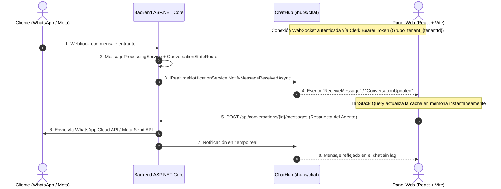

# Fase 5 — Conexión en Tiempo Real con Frontend React + SignalR + Inbox Web

Este documento detalla la arquitectura de tiempo real, la sincronización de estado, los componentes del panel de agentes y la integración completa implementada en la **Fase 5** del SaaS ChatOmnicanal.

---

## 1. Resumen y Objetivo

La **Fase 5** conecta el backend .NET 8 con el frontend web React (Vite + TypeScript + TanStack Query + Zustand + Tailwind + Clerk), brindando una experiencia en tiempo real sin recargas:

- **WebSockets Bidireccionales con SignalR (`/hubs/chat`):** Envío y recepción instantánea de mensajes y cambios de estado con autenticación JWT de Clerk.
- **Bandeja de Entrada Omnicanal Unificada:** Listado de conversaciones por canal (WhatsApp, Instagram, Messenger), estado (`Bot`, `InQueue`, `Human`, `Closed`), búsqueda por contacto/texto y filtro rápido por estados.
- **Chat en Vivo para Operadores:**
  - Historial cronológico con diferenciación visual clara entre mensajes de Usuario, Bot IA y Agente Humano.
  - Temporizador visual de la ventana de 24 horas de Meta con alertas cuando restan pocas horas o ha caducado.
  - Controles de estado: *Tomar control* (pasa de Bot/InQueue a Humano), *Resolver conversación* y *Reabrir conversación*.
- **Configuración del Negocio y Horarios:** Editor visual de horarios semanales por día (Lunes a Domingo con switches de apertura/cierre), zona horaria IANA, tono del bot y políticas de envíos y medios de pago.
- **Base de Conocimiento RAG:** Ingestión de documentos (PDF, TXT) y creador de FAQs con fragmentación y vectorización automática en PostgreSQL `pgvector`.
- **Simulador Interactivo del Bot:** Consola de prueba para interactuar con Groq LPU, con visualización de tokens consumidos (prompt + completion) y desglose de fragmentos RAG recuperados con puntaje de similitud coseno.

---

## 2. Arquitectura de Tiempo Real

---

## 3. Módulos y Componentes Implementados

### 3.1. Backend SignalR (`ChatOmnicanal.API` y `Infrastructure`)
- **`ChatHub` (`/hubs/chat`):** Hub protegido con `[Authorize]` que agrupa conexiones por `tenant_{tenantId}` y salas individuales `conversation_{conversationId}`.
- **`IRealtimeNotificationService` & `SignalRRealtimeNotificationService`:**
  - `NotifyMessageReceivedAsync`: Transmite mensajes entrantes (usuarios) y salientes (bot o agente).
  - `NotifyConversationUpdatedAsync`: Transmite actualizaciones de metadata, último mensaje y ventana de 24h.
  - `NotifyConversationStatusChangedAsync`: Transmite cambios de estado (`Bot`, `InQueue`, `Human`, `Closed`).
- **Autenticación en WebSockets:** Soporte para extracción de access token desde `context.Request.Query["access_token"]` en `OnMessageReceived` de JWT Bearer.
- **CORS:** Política `FrontendCorsPolicy` con soporte de credenciales (`AllowCredentials()`) para orígenes locales y de producción.

### 3.2. Frontend Conexión y Estado (`apps/web`)
- **`src/lib/apiClient.ts`:** Instancia de Axios con interceptor dinámico de Clerk para inyectar automáticamente `Authorization: Bearer <token>`.
- **`src/store/signalRStore.ts`:** Store de Zustand para monitorear el estado de la conexión en vivo (`connected`, `connecting`, `reconnecting`, `disconnected`).
- **`src/hooks/useSignalR.ts`:** Hook que administra el ciclo de vida de `HubConnection`, reconexión automática con backoff exponencial e invalidación/actualización reactiva de queries de TanStack Query.
- **Indicador de Conexión en Sidebar:** Punto de estado visual en la barra lateral (Verde = Conectado en vivo, Amarillo = Reconectando, Rojo = Desconectado).

### 3.3. Vistas del Panel Web
1. **Bandeja de Entrada (`ConversationsPage` & `ConversationList`):**
   - Selector de canal con íconos específicos.
   - Pestañas de estado (*Todos*, *Bot*, *En cola*, *Humanos*, *Cerrados*).
   - Buscador por nombre de contacto, teléfono o contenido del mensaje.
   - Badges de ventana de 24h activa o vencida.
2. **Chat en Vivo (`ChatPage` & `ChatView`):**
   - Burbujas con estilos diferenciados: Usuario (izquierda), Bot IA (morado con badge Bot Llama 3.3), Agente Humano (azul con badge Agente).
   - Contador regresivo de ventana de 24h (`WindowCountdown`).
   - Acciones: Botón "Tomar control", "Resolver conversación", "Reabrir conversación".
   - Caja de texto inteligente: Deshabilitada cuando el bot está activo con mensaje orientativo, o aviso de plantilla requerida si la ventana de 24h caducó.
3. **Configuración del Negocio (`SettingsProfilePage` & `BusinessProfileForm`):**
   - Selector interactivo de horarios semanales por día (Lunes a Domingo con switches de apertura/cierre).
   - Configuración de zona horaria IANA, teléfono, email, tono conversacional, envíos y medios de pago.
4. **Base de Conocimiento RAG (`SettingsDocumentsPage` & `DocumentUpload`, `DocumentsList`):**
   - Subida de archivos PDF y TXT.
   - Creación directa de FAQs y notas de texto.
   - Visualización de fragmentos (chunks) vectorizados y borrado con confirmación.
5. **Simulador del Bot (`SimulationPage` & `BotSimulationChat`):**
   - Conversación interactiva de prueba con Groq y RAG pgvector.
   - Inspección en tiempo real de fragmentos pgvector recuperados con su similitud coseno (ej. 88.5%).
   - Telemetría de tokens consumidos y alertas de handoff.

---

## 4. Verificaciones y Pruebas

1. **Pruebas de Backend (.NET 8):**
   - **52 pruebas automatizadas en verde** (32 unitarias de dominio + 20 de integración sobre PostgreSQL 16 con `pgvector` y SignalR).
2. **Pruebas de Frontend (TypeScript / Vite):**
   - `npm run typecheck`: **0 errores de tipos**.
   - `npm run build`: **Compilación de producción exitosa**.
