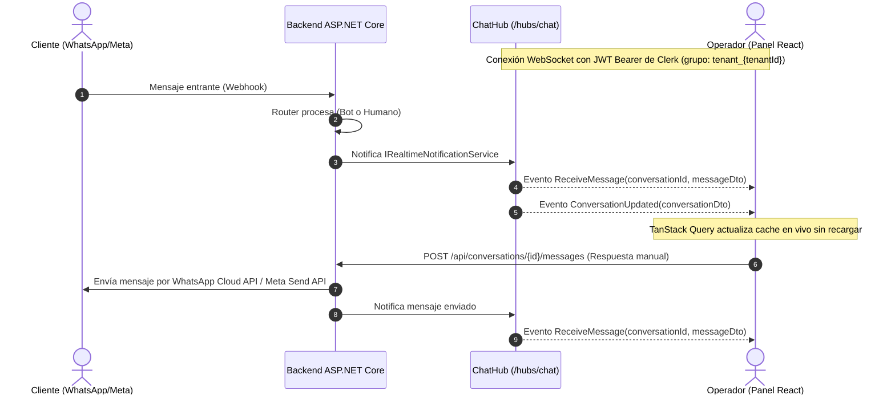

# Phase 5 — Conexión en Tiempo Real con Frontend React + SignalR + Inbox Web

> **Goal:** Conectar el frontend React (Vite + TypeScript + TanStack Query + Zustand + Tailwind + Clerk) con el backend .NET 8 en tiempo real mediante SignalR (`/hubs/chat`), implementando la bandeja de entrada omnicanal completa, chat en vivo para operadores con control de ventana de 24h, gestión de perfil y horarios del negocio, base de conocimiento RAG y simulador interactivo del bot.

---

## 1. Arquitectura de Tiempo Real (SignalR + React)



---

## 2. Mapa de Archivos a Modificar / Crear

### Backend (`apps/api`)
```
src/ChatOmnicanal.Application/
  Common/Interfaces/
    IRealtimeNotificationService.cs      # Contrato de notificaciones en tiempo real
src/ChatOmnicanal.API/
  Hubs/
    ChatHub.cs                          # SignalR Hub mapeado a /hubs/chat
  Services/
    SignalRRealtimeNotificationService.cs # Implementación de IRealtimeNotificationService
  Program.cs                            # Registro de SignalR, CORS y MapHub
  DependencyInjection.cs                # JWT Bearer options con token en query string para WebSockets
src/ChatOmnicanal.Infrastructure/
  Conversations/
    ConversationStateRouter.cs          # Dispara notificaciones en tiempo real en cada mensaje/handoff
    ConversationService.cs              # Dispara notificaciones al tomar control, resolver o enviar mensaje
tests/ChatOmnicanal.Integration.Tests/
  Hubs/
    ChatHubIntegrationTests.cs          # Tests de SignalR y autenticación
```

### Frontend (`apps/web`)
```
src/
  types/
    api.types.ts                        # Sincronización exacta con DTOs de backend
  lib/
    apiClient.ts                        # Axios con interceptor de Clerk JWT
    queryClient.ts
  store/
    signalRStore.ts                     # Estado de conexión SignalR con Zustand
  hooks/
    useSignalR.ts                       # Conexión persistente y listeners de eventos en vivo
    useConversations.ts                 # Hooks React Query para conversaciones
    useMessages.ts                      # Hooks React Query para mensajes y envío
    useTenantProfile.ts                 # Hooks React Query para perfil y horarios
    useKnowledge.ts                     # Hooks React Query para RAG (upload, text, delete)
    useBotSimulation.ts                 # Hook para simulación de bot
  services/
    conversations.ts                    # Endpoints /api/conversations
    messages.ts                         # Endpoints /api/conversations/{id}/messages
    tenantProfile.ts                    # Endpoints /api/tenant-profile
    knowledge.ts                        # Endpoints /api/knowledge
    simulation.ts                       # Endpoints /api/bot/simulate
  components/
    layout/
      AppLayout.tsx                     # Sidebar + Inicializador de SignalR
    conversations/
      ConversationList.tsx              # Lista con filtros, búsqueda y badges
      ConversationItem.tsx              # Item de conversación con preview y estados
      ConversationFilters.tsx           # Filtros por canal y estado
      ChannelBadge.tsx                  # Iconos y badges de canal
      StatusBadge.tsx                   # Badges de estado (Bot, Human, InQueue, Closed)
    chat/
      ChatView.tsx                      # Chat en vivo con timeline
      MessageBubble.tsx                 # Burbujas estilizadas por autor (User, Bot, Agent)
      MessageInput.tsx                  # Input de texto con validación de ventana 24h
      WindowCountdown.tsx               # Contador visual regresivo de la ventana 24h
      TakeControlButton.tsx             # Botón "Tomar Control"
      ResolveButton.tsx                 # Botón "Resolver Conversación"
    settings/
      BusinessProfileForm.tsx           # Horarios semanales, envíos, pagos, tono
      DocumentUpload.tsx                # Subida de PDF y TXT para RAG
      DocumentsList.tsx                 # Lista de documentos indexados con chunks
    simulation/
      BotSimulationChat.tsx             # Simulador con inspección de chunks RAG y tokens
  pages/
    ConversationsPage.tsx
    ChatPage.tsx
    SettingsProfilePage.tsx
    SettingsDocumentsPage.tsx
    SimulationPage.tsx
```

---

## 3. Plan de Ejecución Tarea por Tarea

### Tarea 1: Backend SignalR y Notificaciones en Tiempo Real
- [ ] Crear `IRealtimeNotificationService` en `ChatOmnicanal.Application`.
- [ ] Crear `ChatHub` en `ChatOmnicanal.API.Hubs`.
- [ ] Crear `SignalRRealtimeNotificationService` en `ChatOmnicanal.API.Services` y registrarlo en DI.
- [ ] Configurar CORS (`AddCors`) y soporte de JWT en query string (`OnMessageReceived`) en `Program.cs` y `DependencyInjection.cs`.
- [ ] Mapear `/hubs/chat` en `Program.cs`.
- [ ] Conectar `IRealtimeNotificationService` en `ConversationStateRouter` y `ConversationService`.
- [ ] Agregar tests de integración en `ChatOmnicanal.Integration.Tests`.

### Tarea 2: Tipos y Cliente API en Frontend
- [ ] Actualizar `src/types/api.types.ts` para reflejar fielmente los DTOs de backend (`ConversationDto`, `ConversationDetailDto`, `MessageDto`, `MessagingWindowDto`, `TenantProfileDto`, `KnowledgeDocDto`, `BotSimulateDto`).
- [ ] Configurar `apiClient.ts` con interceptor para inyectar el Bearer Token de Clerk.
- [ ] Implementar servicios `conversations.ts`, `messages.ts`, `tenantProfile.ts`, `knowledge.ts`, `simulation.ts`.

### Tarea 3: Conexión SignalR y Zustand Store en Frontend
- [ ] Crear `src/store/signalRStore.ts` con Zustand para monitorear el estado de la conexión (`connected`, `connecting`, `disconnected`, `reconnecting`).
- [ ] Crear `src/hooks/useSignalR.ts` usando `@microsoft/signalr` `HubConnectionBuilder`:
  - Token factory dinámico con Clerk `getToken()`.
  - Listeners para `ReceiveMessage`, `ConversationUpdated`, `ConversationStatusChanged`.
  - Invalida y sincroniza automáticamente las queries de React Query.
- [ ] Invocar `useSignalR` en `AppLayout.tsx`.

### Tarea 4: Bandeja de Entrada y Chat en Vivo
- [ ] Implementar `ConversationList`, `ConversationItem`, `ConversationFilters`, `ChannelBadge`, `StatusBadge`.
- [ ] Implementar `ChatView`, `MessageBubble`, `MessageInput`, `WindowCountdown`, `TakeControlButton`, `ResolveButton`.
- [ ] Conectar `ConversationsPage` y `ChatPage` con navegación fluida y reactiva.

### Tarea 5: Configuración del Negocio y Base de Conocimiento RAG
- [ ] Implementar `BusinessProfileForm` con selector de días y horarios, zona horaria, tono y políticas.
- [ ] Implementar `SettingsDocumentsPage` con `DocumentUpload` (PDF, TXT, FAQ) y `DocumentsList` con borrado de documentos.
- [ ] Implementar `SettingsProfilePage`.

### Tarea 6: Simulador del Bot Interactivo
- [ ] Implementar `BotSimulationChat` y `SimulationPage` con visualización de tokens consumidos, chunks RAG recuperados con puntaje de similitud y banderas de handoff.

### Tarea 7: Validación, Tests y Compilación
- [ ] Ejecutar `dotnet test apps/api/ChatOmnicanal.sln` -> 100% pasando.
- [ ] Ejecutar `npm run typecheck` en `apps/web` -> 0 errores.
- [ ] Ejecutar `npm run build` en `apps/web` -> Compilación exitosa.
- [ ] Crear `docs/fase-5-realtime-frontend.md` y commitear en Git.
